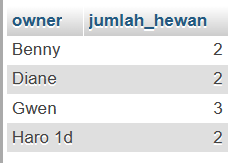

# Praktikum_4
Implemenatsi SQL CONSRAINT QUERY FILTERING

## Profil
| Variable | Isi |
| -------- | --- |
| **Nama** | Gilar Sumilar |
| **NIM** | 312210407 |
| **Kelas** | TI.22.A4 |
| **Mata Kuliah** | Basis data |

## Soal Praktikum_4
### Tugas Praktikum-1


1. Tampilkan pegawai yang gajinya bukan 2.000.000 dan 1.250.000 !
2. Tampilkan pegawai yang tunjangannya NULL!
3. Tampilkan pegawai yang tunjangannya tidak NULL!
4. Tampilkan/hitung jumlah baris/record tabel pegawai!
5. Tampilkan/hitung jumlah total gaji di tabel pegawai!
6. Tampilkan/hitung rata-rata gaji pegawai!
7. Tampilkan gaji terkecil!
8. Tampilkan gaji terbesar!

- *Note : Tempat untuk menulis query SQL pada phpMyAdmin*


### 1. Tampilkan pegawai yang gajinya bukan 2.000.000 dan 1.250.000 !
**Query :**
```sql
SELECT * FROM tb_pegawai WHERE gajih NOT IN (2000000, 1250000);
```

**Output :**


### 2. Tampilkan pegawai yang tunjangannya NULL!
**Query :**
```sql
SELECT * FROM tb_pegawai WHERE tunjangan IS NULL;
```

**Output :**


### 3. Tampilkan pegawai yang tunjangannya tidak NULL!
**Query :**
```sql
SELECT * FROM tb_pegawai WHERE tunjangan IS NOT NULL;
```

**Output :**


### 4. Tampilkan/hitung jumlah baris/record tabel pegawai!
**Query :**
```sql
SELECT COUNT(*) AS jumlah_baris FROM tb_pegawai;
```

**Output :**


### 5. Tampilkan/hitung jumlah total gaji di tabel pegawai!
**Query :**
```sql
SELECT SUM(gaji) AS total_gaji FROM tb_pegawai;
```

**Output :**


### 6. Tampilkan/hitung rata-rata gaji pegawai!
**Query :**
```sql
SELECT AVG(gaji) AS rata_gaji FROM tb_pegawai
```

**Output :**


### 7. Tampilkan gaji terkecil!
**Query :**
```sql
SELECT MIN(gaji) AS gaji_terkecil FROM pegawai;
```

**Output :**


### 8. Tampilkan gaji terbesar!
**Query :**
```sql
SELECT MAX(gaji) AS gaji_terbesar FROM tb_pegawai;
```

**Output :**


## Tugas Praktikum-2


1. Tampilkan jumlah hewan yang dimiliki setiap owner.
2. Tampilkan jumlah hewan berdasarkan spesies.
3. Tampilkan jumlah hewan berdasarkan jenis kelamin.
4. Tampilkan jumlah hewan berdasarkan spesies dan jenis kelamin.
5. Tampilkan jumlah hewan berdasarkan spesis (cat dan dog saja) dan jenis kelamin.
6. Tampilkan jumlah hewan berdasarkan jenis kelamin yang diketahui saja.


### 1. Tampilkan jumlah hewan yang dimiliki setiap owner.
**Query :**
```sql
SELECT owner, COUNT(*) AS jumlah_hewan FROM tb_hewan GROUP BY owner;
```

**Output :**



### 2. Tampilkan jumlah hewan berdasarkan spesies.
**Query :**
```sql
SELECT species, COUNT(*) AS jumlah_hewan FROM tb_hewan GROUP BY species;
```

**Output :**


### 3. Tampilkan jumlah hewan berdasarkan jenis kelamin.
**Query :**
```sql
SELECT sex, COUNT(*) AS jumlah_hewan FROM tb_hewan GROUP BY sex;
```

**Output :**


### 4. Tampilkan jumlah hewan berdasarkan spesies dan jenis kelamin.
**Query :**
```sql
SELECT species, sex, COUNT(*) AS jumlah_hewan FROM hewan GROUP BY species,sex;
```

**Output :**


### 5. Tampilkan jumlah hewan berdasarkan spesis (cat dan dog saja) dan jenis kelamin.
**Query :**
```sql
SELECT species, sex, COUNT(*) AS jumlah_hewan FROM tb_hewan
WHERE species IN('Cat','Dog')
GROUP BY species, sex;
```

**Output :**


### 6. Tampilkan jumlah hewan berdasarkan jenis kelamin yang diketahui saja.
**Query :**
```sql
SELECT sex, COUNT(*) AS jumlah_hewan FROM tb_hewan
WHERE sex IN('f','m')
GROUP BY sex;
```

**Output :**


## Kesimpulan
Query filtering dalam database adalah proses memilih data dari database berdasarkan kriteria tertentu. Misalnya, kamu bisa mengambil semua pelanggan yang memiliki usia di atas 30 tahun. Dengan menggunakan filter, kamu dapat membatasi data yang ditampilkan agar lebih relevan dengan kebutuhan kamu.
